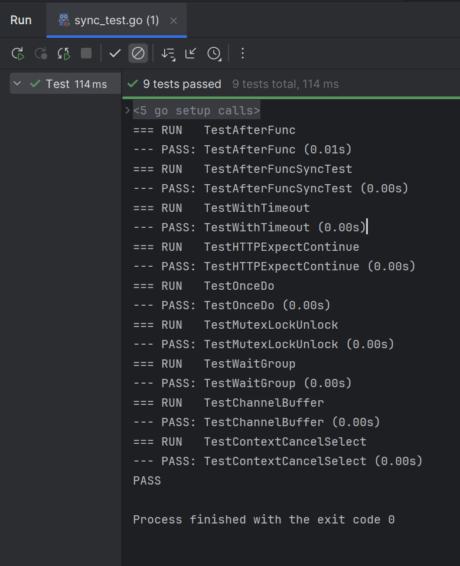

## Einleitung

In parallelen Anwendungen sind sauber getestete und fehlerfreie Synchronisationsmechanismen unverzichtbar, um Data Races und Deadlocks zu verhindern. Seit Go 1.21 kann das `testing/synctest`-Paket über `GOEXPERIMENT=synctest` aktiviert werden. Es erlaubt das Schreiben deterministischer Tests für concurrency-sensitive Komponenten aus den Paketen `sync` und `context`, indem es die Ausführung von Goroutinen überwacht und kontrolliert.

## Welches Problem wird gelöst?

Herkömmliche Tests für nebenläufigen Code beruhen häufig auf `time.Sleep` oder komplexen channel-Konstrukten, um bestimmte Ablaufpfade von Goroutinen zu erzeugen. Diese Ansätze sind jedoch anfällig für flackernde („flaky“) Tests, da das tatsächliche Scheduling von der Laufzeitumgebung abhängt. Außerdem erschwert die fehlende Kontrolle über die genaue Reihenfolge von Ereignissen das Debugging, und viele mögliche Kombinationen von Goroutine-Interaktionen bleiben ungetestet.

## Die Lösung mit `synctest`

Mit `synctest` werden Tests in einer kontrollierten Testumgebung (instrumented test harness) ausgeführt, die alle gestarteten Goroutinen koordiniert an definierten Haltepunkten mit `synctest.Wait` pausieren lässt. So kann man zum Beispiel prüfen, dass ein Callback erst nach dem Aufruf von `cancel()` ausgelöst wird, statt auf unsichere Sleeps zu setzen. In Verbindung mit `synctest.Explore` lassen sich darüber hinaus automatisiert alle denkbaren Scheduling-Pfade durchspielen, um seltene Race-Bedingungen systematisch zu entdecken. Indem `synctest` gezielt Konflikte provoziert und wiederholbar verifiziert, entstehen keine zufälligen Testfehler mehr.

### Beispiel: Deterministischer Test für `context.AfterFunc`

Im konventionellen Test wird `time.Sleep` verwendet, um das Timing des Callbacks sicherzustellen:

```go
func TestAfterFunc(t *testing.T) {
    ctx, cancel := context.WithCancel(context.Background())
    called := make(chan struct{})
    context.AfterFunc(ctx, func() { close(called) })

    // Vor cancel() darf der Callback nicht ausgelöst werden
    select {
    case <-called:
        t.Fatalf("wurde zu früh aufgerufen")
    case <-time.After(10 * time.Millisecond):
    }

    cancel()
    select {
    case <-called:
    case <-time.After(10 * time.Millisecond):
        t.Fatalf("wurde nicht aufgerufen nach Cancel")
    }
}
```

Mit `synctest` lässt sich dieser Ablauf ohne Sleeps und deterministisch prüfen:

```go
func TestAfterFuncSyncTest(t *testing.T) {
    synctest.Run(func() {
        ctx, cancel := context.WithCancel(context.Background())
        called := false
        context.AfterFunc(ctx, func() { called = true })

        synctest.Wait() // alle Goroutinen pausieren
        if called {
            t.Fatalf("wurde zu früh aufgerufen")
        }

        cancel()
        synctest.Wait() // Callback nach cancel() verifizieren
        if !called {
            t.Fatalf("wurde nicht aufgerufen nach Cancel")
        }
    })
}
```

## Anwendungsbeispiele

In der Praxis wird `synctest` eingesetzt, um unter anderem `sync.Map`-Operationen wie `Store`, `Load` und `Delete` unter kontrollierten Race-Bedingungen zu testen. Ebenso kann man das Verhalten von `sync.Pool` beim gleichzeitigen Aus- und Einlagern von Objekten überprüfen oder sicherstellen, dass `sync.WaitGroup` mit `Add`, `Done` und `Wait` korrekt zusammenspielt. So lässt sich zum Beispiel mit nur wenigen Zeilen Code verifizieren, dass `sync.Once` tatsächlich nur einmal ausgeführt wird, selbst wenn `Do` mehrfach aufgerufen wird:

```go
func TestOnceDo(t *testing.T) {
    synctest.Run(func() {
        var once sync.Once
        counter := 0
        once.Do(func() { counter++ })
        once.Do(func() { counter++ })
        once.Do(func() { counter++ })

        if counter != 1 {
            t.Fatalf("Do sollte genau einmal ausgeführt werden, lief aber %d mal", counter)
        }
    })
}
```

Und selbst verteilte Zähler lassen sich einfach überprüfen, indem man etwa drei Goroutinen startet und wartet, bis alle `Done()` aufgerufen haben:

```go
func TestWaitGroup(t *testing.T) {
    synctest.Run(func() {
        var wg sync.WaitGroup
        const routines = 3
        counter := 0

        wg.Add(routines)
        for i := 0; i < routines; i++ {
            go func() {
                defer wg.Done()
                counter++
            }()
        }

        synctest.Wait() // blockiert, bis alle Done() erfolgt sind
        if counter != routines {
            t.Fatalf("gewartet auf %d Goroutinen, tatsächlich %d", routines, counter)
        }
    })
}
```

## Bewertung und Grenzen

`testing/synctest` macht Nebenläufigkeitstests deterministisch und reproduzierbar, wodurch komplexe Tricks mit Sleeps und Kanälen überflüssig werden. Durch die automatische Erkundung aller Scheduling-Pfade werden seltene Race-Bedingungen zuverlässig entdeckt. Als Teil des Go-Standards seit Version 1.21 integriert sich das Paket nahtlos in bestehende Projekte.

Gleichzeitig erfordert der Einsatz von `synctest` ein Umdenken, da man sich mit Scheduling-Traces und Exploration auseinandersetzen muss. Zudem kann die vollständige Exploration die Testlaufzeit erhöhen. Da `synctest` deterministische Szenarien abdeckt, ersetzt es jedoch nicht die klassische Race-Detection mit `go test -race`, sondern ergänzt diese.

## Relevanz für die Praxis

Durch die Möglichkeit, Concurrency-Bugs systematisch aufzuspüren und zu reproduzieren, steigt die Zuverlässigkeit von Bibliotheken und Anwendungen deutlich. Entwickler profitieren von flackerfreien Tests und können seltene Race-Zustände gezielt untersuchen, was Zeit spart und die Softwarequalität verbessert.

## Einrichtung der Entwicklungsumgebung

Um `synctest` zu nutzen, wurde für dieses Projekt Go 1.24.1 für Windows installiert. Außerdem wurde die GoLand IDE verwendet  das Projekt mit einem GitHub-Repository zur Versionskontrolle verbunden. In der IDE musste nun das Experiment aktiviert werden. Entweder durch setzen einer Umgebungsvariable in der IDE oder durch das Ausführen von:

```bash
export GOEXPERIMENT=synctest
```

Anschließend können die Tests wie gewohnt mit `go test ./...` oder über die IDE ausgeführt werden.

## Screenshot


